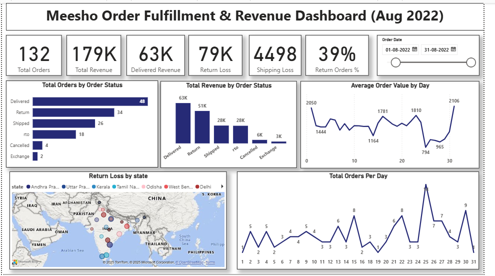

# Meesho Order Fulfillment & Revenue Dashboard (August 2022)

## 🚀 Objective
To reduce losses from RTOs (Return to Origin) and Returns by identifying revenue leakage, shipping losses, and fulfillment inefficiencies using Meesho order-level data.

## 📊 Tools Used
- Power BI
- DAX
- Excel (for preprocessing)

## 📷 Dashboard Preview

### 🔹 Default View 

## 📌 Key KPIs
- Total Orders: 132  
- Total Revenue: ₹179K  
- Delivered Revenue: ₹63K  
- Return Loss: ₹79K  
- Shipping Loss: ₹4.5K  
- Return Order %: 39%

## 📈 Dashboard Highlights
- Orders & Revenue breakdown by Order Status
- Return Loss mapped by State
- AOV trends and Daily Order trends
- Insights panel with business recommendations

## 🧠 Business Insights
- 39% of orders were Return/RTO causing ~₹79K loss
- States like Uttar Pradesh, Delhi, and Andhra Pradesh contributed most to losses
- High AOV correlated with higher return rates

## ✅ Recommendations
- Implement pre-shipment checks for high-value orders
- Pilot prepaid-only in high-loss states
- Review courier SLA for Return-heavy zones
- Introduce SKU-based return prediction logic

## 📂 Dataset
Dataset used:  
📥 [Meesho Order Data – Kaggle](https://www.kaggle.com/datasets/sahilr05/meesho-orders)

---

### 👨‍💻 About Me  
**Kanishka Narayan Choudhury**  
Aspiring Data Analyst | Excel • SQL • Power BI • Python  
📫 [LinkedIn Profile](https://www.linkedin.com/in/kanishka-n-choudhury/)

